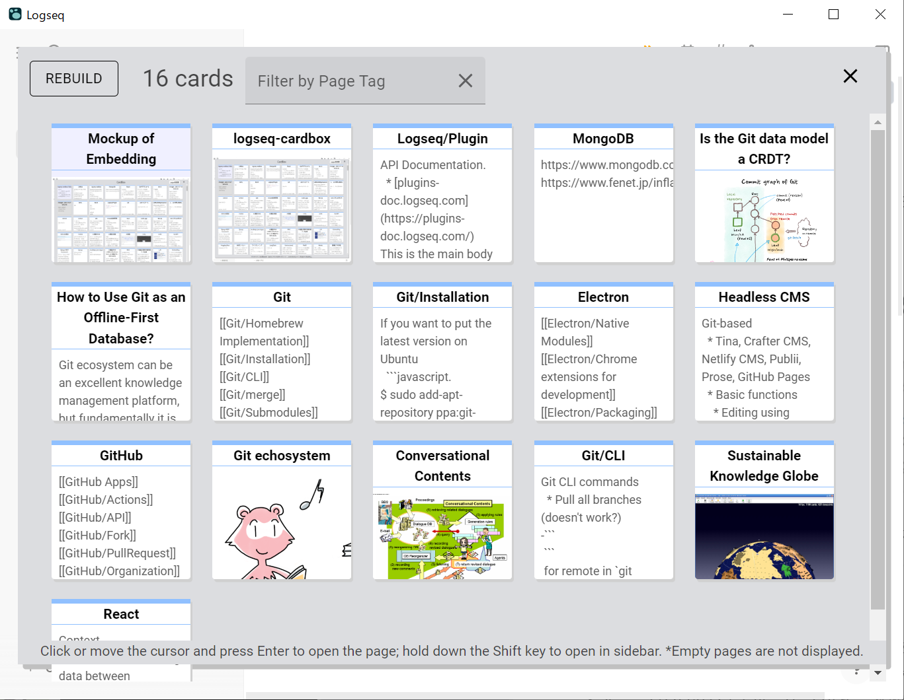
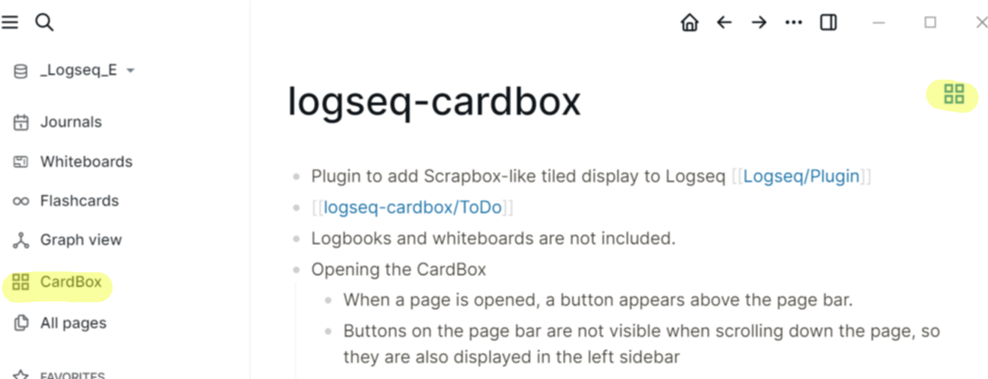
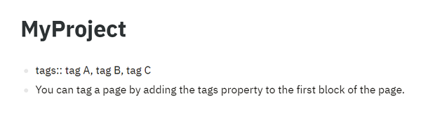

# Logseq CardBox Plugin 

English / [日本語](https://scrapbox.io/logseq-ja/Logseq_Cardbox_Plugin%2F%E4%BD%BF%E3%81%84%E6%96%B9)

Plugin to add thumbnail cards to [Logseq](https://github.com/logseq/logseq) that are displayed in order of update.

## How to launch
Any of the following:
- "CardBox" button on the left sidebar
- Click the CardBox icon in the top right corner of the page
- Enter "Open CardBox" in the command palette
- Shortcut:
  - (Windows) Ctrl + Shift + Enter
  - (macOS) Cmd + Shift + Enter
 

	
- Immediately after installation, CardBox will automatically build the database. During this time, the message "Building..." will appear in the upper left corner of the CardBox. Do not exit Logseq until this message disappears.

## Selecting a card
- The thumbnail cards of the pages are ordered by the date of the last update, starting from the top left.
  - Only pages are displayed. The journal and whiteboard are not displayed.
- Click on a page or use the cursor keys to move the selection and press Enter to open it.
  - If you hold down Shift while performing the open operation, the page will open in the sidebar.

## Filtering using page tags
- Type a character key to filter cards by a page tag
- What is a page tag? See below:

## Closing the CardBox
- Close CardBox by pressing the X button in the top right-hand corner or pressing the Esc key.

## Key bindings
- Any character keys: Input a page tag
- Up, Down, Left, Right: Move the cursor to select a card
- Enter: Open the selected card
- Shift+Enter: Open the selected card in the sidebar
- Esc: Close the CardBox

## Languages supported 
- English
- Japanese

You need to restart Logseq for the language change to take effect.

## Limitations
- CardBox will not display pages without body text.
	- Logseq does not create a .md file for a page with only a title without body text. This plug-in reads the modification time of the .md file directly, so it cannot display pages with no file.
- Since Logseq is currently in beta, it cannot correctly manage the modification time of pages. If the modification time is incorrect, please press the "Rebuild" button (it will get the modification time directly from the specified pages folder).
  - See https://github.com/logseq/logseq/issues/8556
- Changes made directly to the .md file while Logseq is not running will not be reflected in the CardBox.
	- To reflect them, press the 'Rebuild' button.
- After executing the "Re-index" in Logseq, press the "Rebuild" button in the CardBox.
  - If you do not rebuild, pages may not be displayed in the correct time order.
  - If you do not rebuild, you cannot open the page in the sidebar from CardBox.
- Pages with a slash at the end of the title (e.g. MyPage/ ) will not display correctly.

# Support

If you like it, please donate to me to continue the development.

